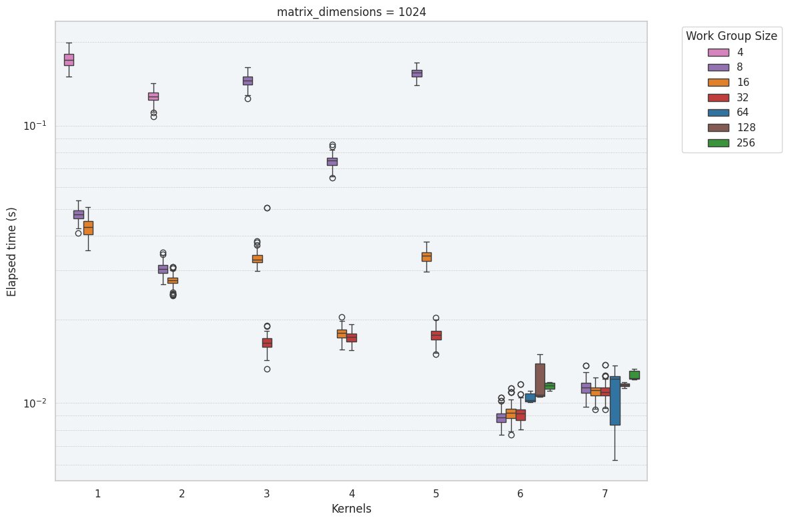
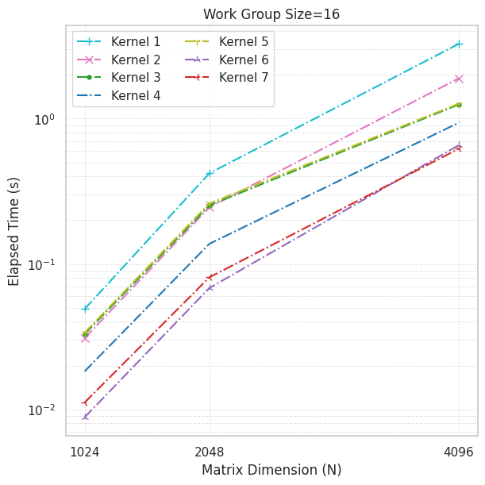
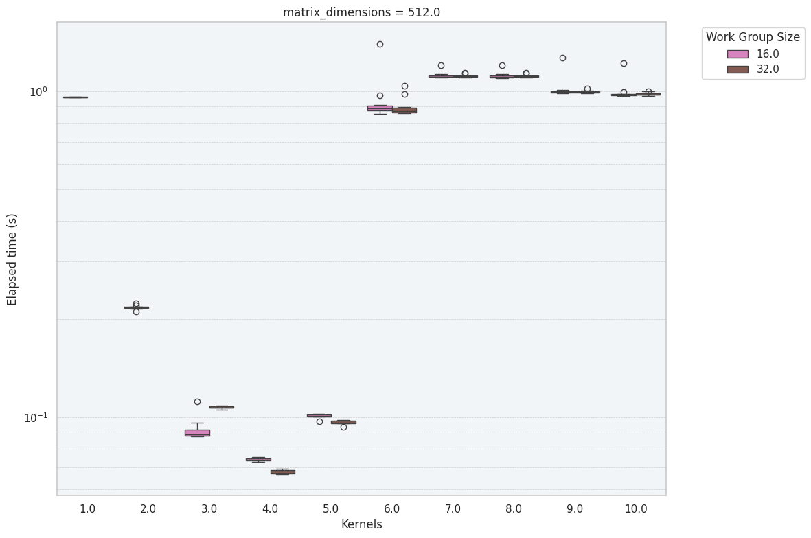
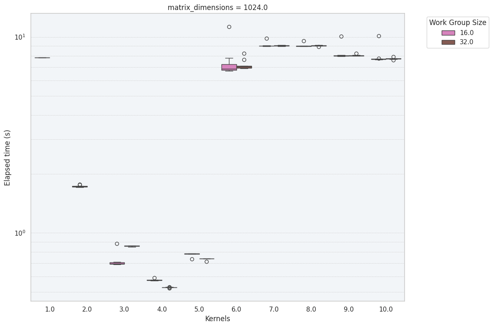
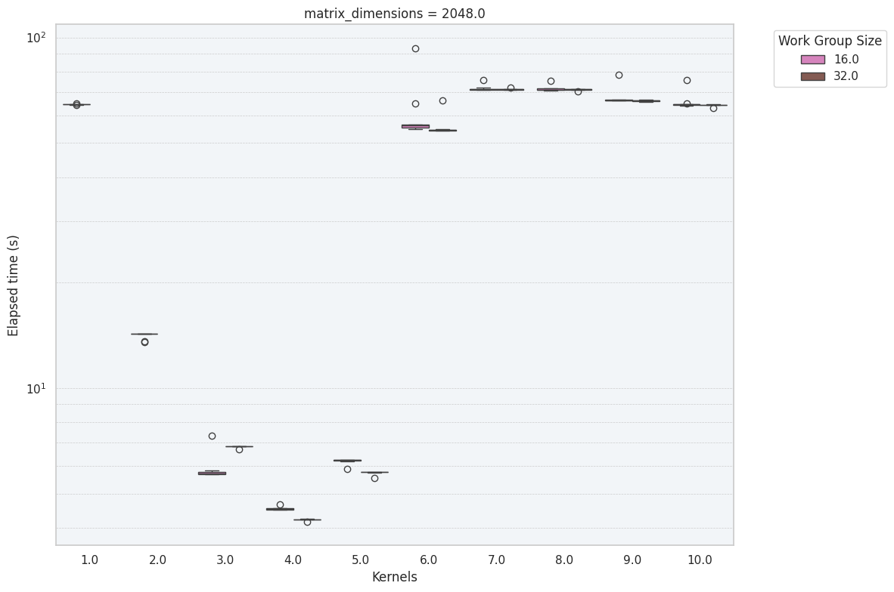

YADRO WINTER SCHOOL 2025
=============

The code has been modified by removing CUDA dependencies and little bit optimizing parameters for precise performance measurements. Additionally, Python scripts have been added to automate experiments and data collection.

## Requirements

- OpenCL drivers, CMake, a C++ compiler, and Python 3

## Automate Experiments:

`tune_mygemm.py` allows to choose and adjust the parameters for experiments (different kernels, group sizes, and compiler options).

```
python3 tune_mygemm.multiple_run.py
```
This script runs the benchmark multiple times, collecting a larger sample size for more reliable results.


Results for my GPU(AMD Radeon Vega 8):
=============
Зависимость времени от work group size, matrix dimension = 1024

Зависимость времени от work group size, matrix dimension = 2048

Зависимость времени от work group size, matrix dimension = 4096

Зависимость времени от matrix dimension




Results for StarFive(IMG BXE-4-32):
=============
Зависимость времени от work group size, matrix dimension = 1024

Зависимость времени от work group size, matrix dimension = 2048

Зависимость времени от work group size, matrix dimension = 4096

Зависимость времени от matrix dimension


Exploring the performance of SGEMM in OpenCL on NVIDIA GPUs
=============

Date: 31-Oct-2014 - 07-Nov-2014

Author: Cedric Nugteren, SURFsara (http://www.surfsara.nl)

This repository contains multiple OpenCL implementations of single-precision generalised matrix-multiplication (SGEMM) tuned for an NVIDIA Tesla K40m GPU. The different versions (named myGEMM) are part of a step-by-step tutorial, in which each step adds a new optimisation. The different steps and the details of the OpenCL kernel codes are all explained in depth at https://cnugteren.github.io/tutorial/pages/page1.html.

The OpenCL kernels can be used natively using the OpenCL framework. However, there is also a header-file included which converts the OpenCL kernels into CUDA syntax. This allows the same code to be tested through the CUDA-toolchain.

Apart from the OpenCL kernel codes, this repository contains fully working host code, including a loop over different matrix sizes and different BLAS libraries. It contains code to run NVIDIA's cuBLAS as a reference and the open-source clBlas library.

Pre-requisites:
* A C++ compiler (tested with GCC and ICC)
* The CUDA toolkit and NVCC compiler (tested with version 6.5)
* OpenCL headers and libraries (part of the CUDA toolkit)

Requirements to run the performance and correctness comparisons:
* The cuBLAS library (part of the CUDA toolkit, tested version 6.5)
* The open-source clBlas library (tested 2.2.0)

Usage
=============

*	Compile the code:

		make build

	Compiles the benchmarking infrastructure and the myGEMM kernels. Make sure there is a "bin" and "obj" directory available. Note that you might have to edit the Makefile to set the proper locations of the CUDA and OpenCL installations on your system.

*	Run the code:

		make run

	This runs the code for matrices ranging from MINSIZE to MAXSIZE (defined in src/common.h). It will run cuBLAS, clBlas, and the CUDA and OpenCL versions of the myGEMM kernels. The particular kernel to be executed is defined using the KERNEL keyword in src/settings.h. This file also contains other settings you might want to modify for your particular GPU.

*	Inspect the code:

		make inspect

	This generates all kinds of assembly-like versions of the CUDA kernels in the "bin" subdirectory. It also prints out statistics of the kernels such as the register usage.

Minimal working example
=============

Additionally, we supply the minimal.cpp file in the 'extra' directory. This file is a self-contained minimal working example (MWE) of the most basic SGEMM kernel (myGEMM1). This can be useful if you don't want to deal with Makefiles or don't have the CUDA, cuBLAS, or clBlas installed. Note that minimal.cpp misses some features compared to the main code, but we believe that it can nevertheless be a good starting point if you want to integrate myGEMM into your own code.

The code can be compiled using a regular C++ compiler and only requires OpenCL installed. Example compilation from the root folder:

	g++ -O3 -Wall -I/path/to/opencl/include extra/minimal.cpp -o bin/minimal -lOpenCL

Be aware that the minimal working example does not:
*	Iterate over multiple matrix sizes
*	Compare performance with cuBLAS or clBlas
*	Check for correctness of the results
*	Check for OpenCL errors
*	Load a kernel-file from disk, instead it is embedded as a string

###################################################
